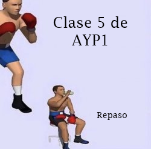

# Clase 5: Repaso

    

En esta clase vamos a repasar y aplicar prácticamente los temas vistos hasta ahora.

# Apunte:

<ol>
<li><h4>Algoritmo:</h4></li>
Pasos ordenados y finitos a seguir para resolver un problema. 
La "receta".
<li><h4>Programación estructurada:</h4></li>
Es un paradigma de la programación. 
Los bloques principales son: estructuras secuenciales, repetitivas y condicionales. 
Modularización (modulos).
<li><h4>Variables y tipos de dato:</h4></li>
Hay variables locales y globales. 
Las globales tienen como scope todo el código (MALO).
Las locales están en un bloque determinado de código (scope, función) y pueden ir variando. 
Es una "caja" que puede almacenar distintos tipos de datos. Numeros, cadenas, etc.
<li><h4>Estructuras secuenciales:</h4></li>
Una secuencia de código que se ejecuta linea por linea.
<li><h4>Funciones:</h4></li>
Bloques de código que cumplen un proposito. 
Sirven para hacer modular el código. Se usa def para "definir". Pueden o no recibir parámetros y pueden o no devolver 
datos.
<li><h4>Estructuras condicionales:</h4></li>
Evalua una condición lógica binaria (True o False). Si se cumple una condición, se ejecuta un bloque de código.
Si no se cumple, se puede o no ejecutar otro. 
Se usa if, elif y else. elif es la simplificación de else if (condiciones anidadas).
<li><h4>Estructuras repetitivas:</h4></li>
Bloque de código que se repite una cantidad de iteraciones. 
Ciclos for: ciclos de iteraciones definidas. Ciclos while: ciclos de iteraciones no definidas.
</ol>

# Ejercicios:

Escribir un programa que:
<ol>
<li>Ingrese un número cualquiera (puede ser float, puede ser negativo) e imprima por pantalla cuantos dígitos enteros tiene.</li>
<li>(Ejercicio 1 pág. 11 de la guía) Escribir un programa, utilizando funciones, que descomponga un número en sus factores primos.</li>
<li>(Ejercicio 6 pág. 11 de la guía) Hacer una función que devuelva el máximo común divisor y el mínimo común múltiplo entre dos enteros.</li>
<li>(<strong>Dificil</strong>) Ingrese un número entero positivo n y muestre por pantalla la serie de Fibonacci hasta el enésimo numero de la forma:

> 0 - 0 
> 1 - 1 
> 2 - 1 
> 3 - 2 
> 4 - 3 
> ... 

Recuerden que el enésimo número de la secuencia de Fibonacci es:

> f(n) = f(n - 1) + f(n - 2)
</li>
</ol>